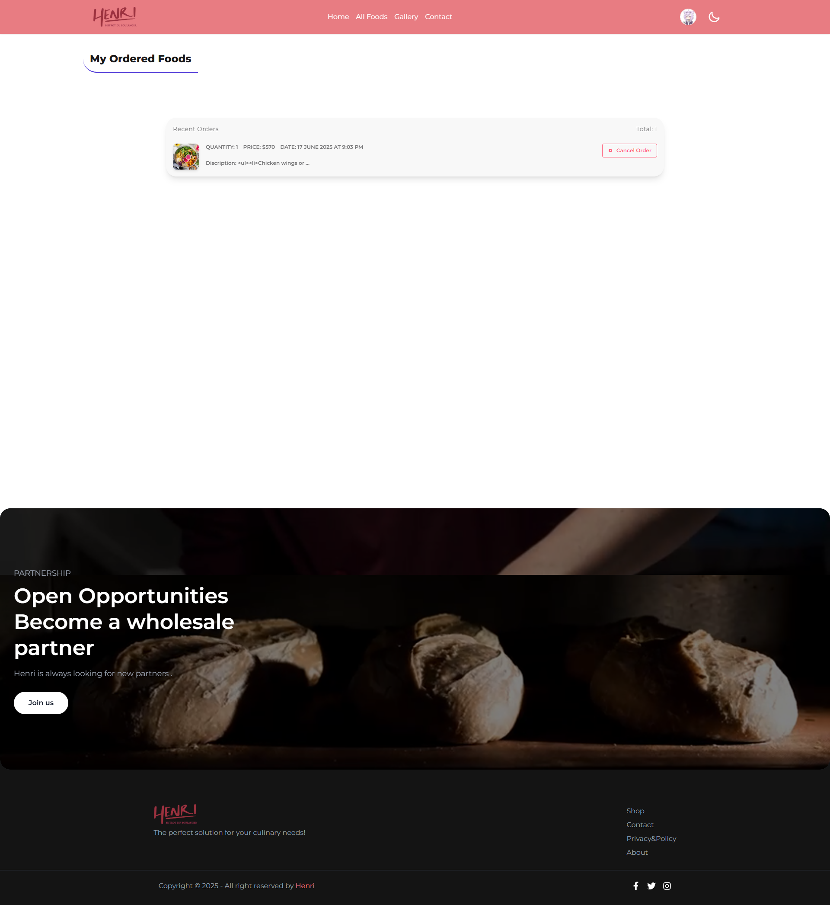

# 🍽️ Henri – Restaurant Management Website

Henri is a full-stack **Restaurant Management Website** designed to offer a seamless and engaging experience for customers while empowering staff with efficient management tools. Built with the **MERN stack**, this platform allows users to explore food items, place orders, manage their own contributions, and interact with the system through a responsive and intuitive user interface.

---

## 🔗 Live Site & Repositories

- 🌐 Live Website: [[Henri - Live](https://henri-app.netlify.app/)] 
- 📁 Client GitHub: [[Henri - Clint](https://github.com/Programming-Hero-Web-Course4/b11a11-client-side-abuhanifsagor)]
- 📁 Server GitHub: [[Henri - Server](https://github.com/Programming-Hero-Web-Course4/b11a11-server-side-abuhanifsagor)]

---

## 🚀 Features

- 🔐 **User Authentication** using Firebase (Email/Password, Google Login)
- ✅ **Protected Routes** for personalized and secure access (e.g., My Foods, Add Food, My Orders, Purchase)
- 🍽️ **Food Management (CRUD)**: Users can add, view, update, and delete their own food items.
- 🛒 **Food Ordering System**: Allows users to purchase food items with quantity checks and owner restrictions.
- 💬 **Comment System**: Users can add comments (though the provided server code had `comments` for general user comments, not directly tied to specific food items for this client side).
- ⭐ **Top Selling Foods Section**: Dynamically displays the 6 most purchased food items on the homepage.
- 🌙 **Dark/Light Mode Toggle**: Provides a personalized viewing experience.
- 📱 Fully Responsive for Mobile, Tablet & Desktop.
- 🔍 **Food Search Functionality**: Easily find food items by name on the "All Foods" page.
- 🖼️ **Interactive Gallery**: Static image gallery with lightbox feature for enlarged viewing.
- 📊 **Order History**: Logged-in users can view and delete their past orders.
- 📦 **Quantity Control**: Prevents users from ordering more than available stock or their own items.
- ✨ **Interactive UI**: Utilizes various libraries for animations and user feedback (e.g., toasts, alerts).

---

## 🖼️ Design Preview

| Page          | Screenshot (Placeholder)                                                                                                                                                               | Description                                    |
| ------------- | -------------------------------------------------------------------------------------------------------------------------------------------------------------------------------------- | ---------------------------------------------- |
| Home          | <div style="width:500px;height:300px;overflow:hidden;"></div>              | Banner slider, top foods, and extra sections   |
| All Foods     | <div style="width:500px;height:300px;overflow:hidden;"></div>     | Browse all food listings with search           |
| Single Food   | <div style="width:500px;height:300px;overflow:hidden;"></div> | Detailed food view with purchase option        |
| My Orders     | <div style="width:500px;height:300px;overflow:hidden;"></div>     | View and delete your placed orders             |
| Gallery       | <div style="width:500px;height:300px;overflow:hidden;"></div>        | Static image gallery with lightbox             |
| Login         | <div style="width:500px;height:300px;overflow:hidden;"></div>            | Login via email/password or Google             |
| Register      | <div style="width:500px;height:300px;overflow:hidden;"></div>        | Register with validations and Google OAuth     |
| Home          | <div style="width:500px;height:300px;overflow:hidden;"></div>              | Contact information      |

---

## 📌 Routing & Page Structure

| Route           | Description                                                              |
| --------------- | ------------------------------------------------------------------------ |
| `/` or `/home`  | Homepage with banner, top foods, and extra sections                      |
| `/all-foods`    | Browse all food items with search functionality                          |
| `/food/:id`     | Detailed view of a single food item                                      |
| `/purchase/:id` | Form to purchase a food item (Protected Route)                           |
| `/add-food`     | Form to add a new food item (Protected Route)                            |
| `/my-foods`     | View and manage food items added by the current user (Protected Route)   |
| `/my-orders`    | View and manage food items ordered by the current user (Protected Route) |
| `/gallery`      | Photo gallery showcasing restaurant images                               |
| `/login`        | Login page with email/password and social login options                  |
| `/register`     | Registration page with user details and password validation              |
| `/profile`      | User profile page (accessible via navbar dropdown)                       |
| `*` or `/404`   | Not Found page                                                           |

---

## ⚙️ Tech Stack

### 🧩 Frontend

- **React.js**: For building the dynamic user interfaces.
- **React Router DOM**: For client-side routing and navigation.
- **Firebase Authentication**: Handles user authentication (Email/Password, Google).
- **Tailwind CSS / DaisyUI**: For rapid and utility-first styling, ensuring responsive design.
- **Axios**: Promise-based HTTP client for making API requests to the backend.
- **React Toastify / SweetAlert2**: Provides non-blocking notifications and alerts.
- **Yet-Another-React-Lightbox**: For the interactive image gallery.
- **Moment.js**: (Potentially for date/time formatting in "My Orders").
- **Swiper**: For the image slider/banner.
- **Lottie / Framer Motion**: (Optional, for animations and interactive elements).
- **React Icons**: For various icons used throughout the application.

### 🗂 Backend

- **Node.js + Express**: The runtime and framework for the RESTful API.
- **MongoDB**: NoSQL database for flexible and scalable data storage.
- **JWT (JSON Web Tokens)**: For secure, stateless authentication.
- **CORS**: For enabling cross-origin requests.

---

## 📦 Dependencies

_(Note: The list provided was missing commas and quotes, I've formatted it correctly as a `package.json` excerpt. Add any other key dependencies you used.)_

```json
  "dependencies": {
    "@dotlottie/player-component": "^2.7.12",
    "@lottiefiles/dotlottie-react": "^0.13.5",
    "@material-tailwind/react": "^2.1.10",
    "@tailwindcss/vite": "^4.1.5",
    "axios": "^1.10.0",
    "date-fns": "^4.1.0",
    "firebase": "^11.6.1",
    "framer-motion": "^12.18.1",
    "fslightbox-react": "^1.8.0",
    "motion": "^12.18.1",
    "ogl": "^1.0.11",
    "react": "^19.1.0",
    "react-countup": "^6.5.3",
    "react-dom": "^19.1.0",
    "react-fast-marquee": "^1.6.5",
    "react-helmet": "^6.1.0",
    "react-icons": "^5.5.0",
    "react-intersection-observer": "^9.16.0",
    "react-masonry-css": "^1.0.16",
    "react-router": "^7.5.3",
    "react-router-dom": "^7.5.3",
    "react-simple-typewriter": "^5.0.1",
    "react-toastify": "^11.0.5",
    "sweetalert2": "^11.21.2",
    "swiper": "^11.2.6",
    "tailwindcss": "^4.1.5"
}
```

## 🛠️ Installation & Setup

1. Clone the repositories
2. Install dependencies using `$npm install`
3. Setup `.env` for both client and server
4. Run development server: `npm run dev` for client, `node index.js` for server

---

## 🚀 Deployment

1. Deploy client to Netlify
2. Deploy server to Vercel

---

## 📱 Responsive Design

- Fully mobile/tablet/desktop compatible
- Theme switcher: Light and Dark

---

## 👨‍💻 Developer Info

- 🧑 Author: Abu Hanif Sagor
- 🌐 Portfolio: [abuhanifsagor](https://github.com/abuhanifsagor)
- 📧 Email: [abuhanifsagor72@gmail.com](mailto:abuhanifsagor72@gmail.com)

---

> ✨ Have a great day! Thank you for visiting! 🌟
